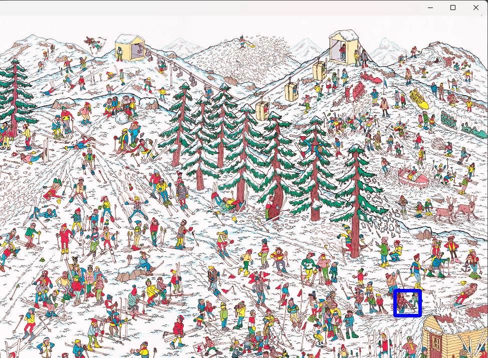

# Finding-wally

This project is a simple OpenCV-based Python script that searches for a specific object (Wally) within an image and highlights its location. The object (Wally) is matched using template matching, and the location is marked with a rectangle in the original image.

## Files

- `findingwally.py`: The main Python script that performs the object detection.
- `nnn.jpg`: The main image where Wally needs to be found.
- `nnn1.png`: The grayscale template image of Wally used for matching.

## Requirements

To run this project, you'll need to have Python and the following libraries installed:

- `opencv-python`

You can install the required library using pip:

```
pip install opencv-python
```
## Usage 

1. Place your main image (nnn.jpg) and the template image (nnn1.png) in the same directory as the script.

2. Run the `findingwally.py` script:
```
python findingwally.py
```
3. The script will display the original image with a rectangle highlighting the location of Wally.

## How It Works
1. The script reads the main image (`nnn.jpg`) and the template image (`nnn1.png`).
2. It converts the main image to grayscale to match the grayscale template.
3. The `cv2.matchTemplate` function is used to find the location of the template within the main image.
4. The location with the highest matching score is identified and marked with a rectangle in the original image.
5. The resulting image with the highlighted area is displayed using `cv2.imshow`.



## Notes
- The script currently assumes the template size is 50x50 pixels. Adjust the bottom_right calculation if your template size is different.
- The template matching method used is cv2.TM_CCOEFF. Experiment with other methods if needed.

## License
This project is licensed under the MIT License - see the [LICENSE](LICENSE) file for details.
